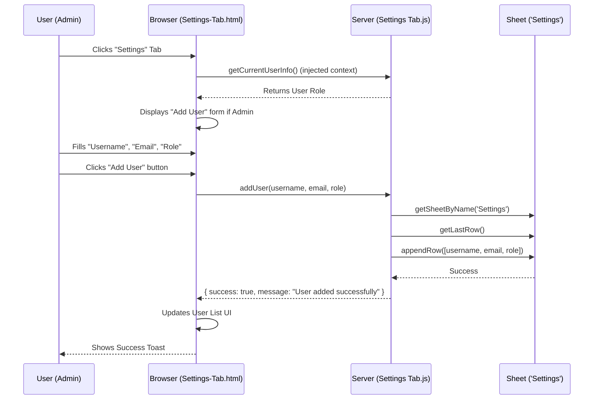
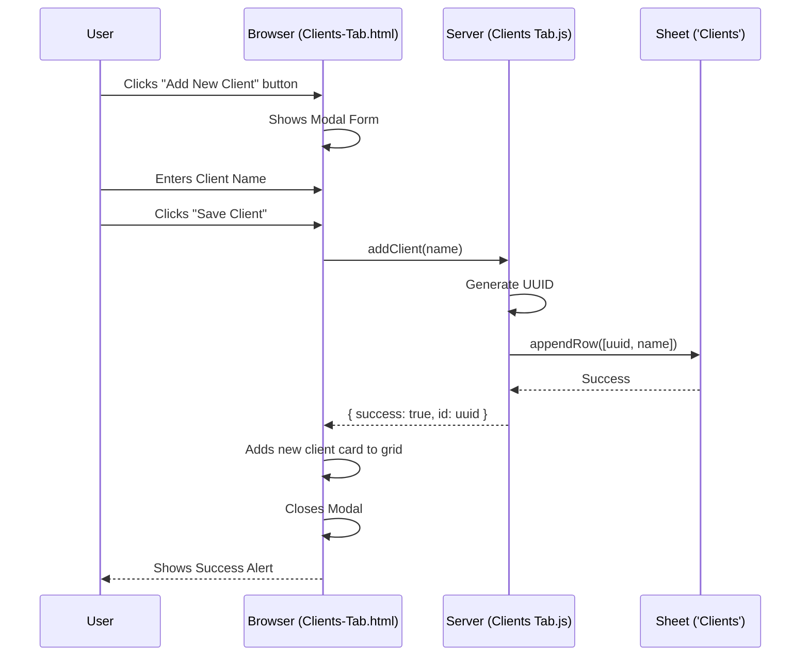
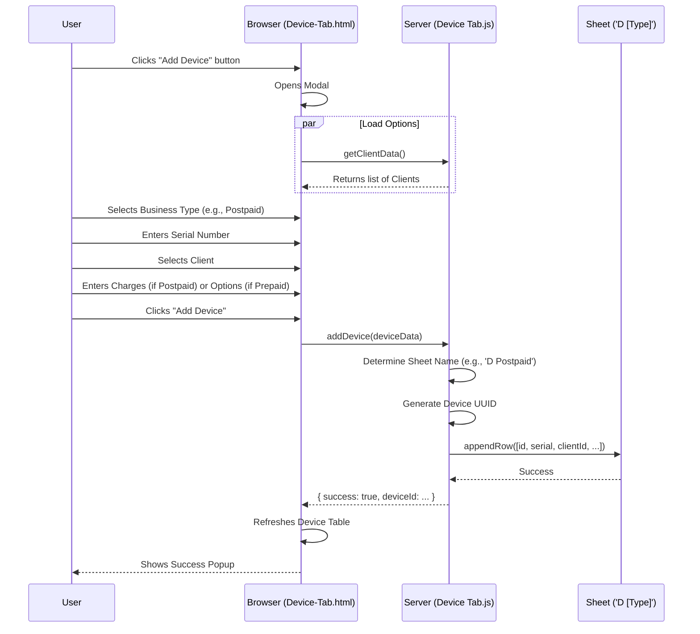

# Credit System Flow Evaluation

This document outlines the architectural flow of the Credit System, detailing how requests are handled, routed, and processed within the Google Apps Script environment.

## System Overview

The Credit System operates as a Single-Page Application (SPA) served via Google Apps Script. It uses a central router to manage navigation and serves dynamic HTML content based on URL parameters.

## Architectural Flow

The following Mermaid diagram illustrates the request lifecycle, from the user's initial interaction to data retrieval from the backend Spreadsheet.

```mermaid
graph TD
    User((User))
    Router[Z Router.js<br/>(doGet)]
    
    subgraph Views [HTML Templates]
        Dashboard[Dashboard-Tab.html]
        Clients[Clients-Tab.html]
        Device[Device-Tab.html]
        Settings[Settings-Tab.html]
        Prepaid[Prepaid-page.html]
        Postpaid[Postpaid-Monthly/TopUp.html]
        RevShare[Revenue-Sharing-Monthly/TopUp.html]
        Error404[404.html]
    end

    subgraph Backend [Server-Side Logic]
        SettingsLogic[Settings Tab.js]
        ClientLogic[Clients Tab.js]
        DeviceLogic[Device Tab.js]
        PrepaidLogic[Prepaid page.js]
        PostpaidLogic[Postpaid page.js]
        RevShareLogic[Revenue Sharing page.js]
        DashboardLogic[Dashboard Tab.js]
    end

    subgraph Database [Google Sheets]
        SettingsSheet[(Settings Sheet)]
        DataSheets[(Data Sheets)]
        ClientsSheet[(Clients Sheet)]
        DashboardSheet[(Dashboard Sheet)]
        DeviceSheets[(Device Sheets e.g., 'D Prepaid', 'D Postpaid')]
    end

    %% Routing Flow
    User -->|Access Web App URL| Router
    Router -->|?page=dashboard| Dashboard
    Router -->|?page=clients-tab| Clients
    Router -->|?page=device-tab| Device
    Router -->|?page=settings-tab| Settings
    Router -->|?page=prepaid| Prepaid
    Router -->|?page=postpaid...| Postpaid
    Router -->|?page=revenue...| RevShare
    Router -->|Invalid Page| Error404

    %% View to Backend Interaction
    Dashboard -.->|google.script.run| DashboardLogic
    Settings -.->|google.script.run| SettingsLogic
    Clients -.->|google.script.run| ClientLogic
    Device -.->|google.script.run| DeviceLogic
    Prepaid -.->|google.script.run| PrepaidLogic
    
    %% Backend to Database Interaction
    SettingsLogic <-->|Read/Write Users| SettingsSheet
    ClientLogic <-->|Read/Write Data| ClientsSheet
    DeviceLogic <-->|Read/Write Data| DeviceSheets
    ClientLogic -- Read Client Info --> DeviceLogic
    PrepaidLogic <-->|Read/Write Data| DataSheets
    DashboardLogic <-->|Read Metrics| DashboardSheet
    
    %% Router Context Injection
    Router -- Inject: userInfo --> SimpleContext((Context))
    SimpleContext -.-> SettingsLogic
    SettingsLogic -- Fetch Role --> SettingsSheet
```

## User Flows

### 1. Adding a New Setting (User)
This flow describes how an administrator might add a new user or configuration setting to the system.



### 2. Adding a New Client
This flow details the process of registering a new client entity in the system.



### 3. Adding a New Device
Adding a device involves associating it with a client and a specific business model (Prepaid, Postpaid, or Revenue Sharing).



## Dashboard Overview

The Dashboard is the central hub for monitoring system health and key metrics. It pulls data from a dedicated `Dashboard` sheet which aggregates data from other parts of the system.

### Content & Metrics

1.  **General Metrics Cards**: High-level counters displayed at the top.
    *   **Total Devices**: Total number of devices registered across all business models.
    *   **Total Clients**: Number of active clients.
    *   **Top Ups**: Count of recent top-up transactions.
    *   **Records**: Total system records.
    *   **Missing Records**: Identification of potential data gaps.
    *   **Total Balance**: Aggregate credit balance across the system.
    *   **Total Utilised**: Total credits consumed.

2.  **Visualizations (Charts)**:
    *   **Payment Status**: A breakdown of payments (e.g., Paid vs. Pending).
    *   **Business Model Distribution**: A chart showing the proportion of devices in Prepaid, Postpaid, and Revenue Sharing models.
    *   **Credit Utilised**: Trends or breakdown of credit usage over time or by category.

### Data Flow for Dashboard
*   The `Dashboard Tab.js` script (`getDashboardData`) reads a specific pre-calculated range in the **'Dashboard'** Sheet (Cells B2:B8 for metrics, and dynamic ranges for charts).
*   This approach keeps the dashboard fast, as it doesn't need to query every single data sheet in real-time; it relies on the spreadsheet formulas to do the heavy lifting.
