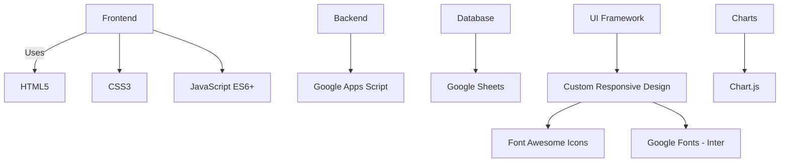
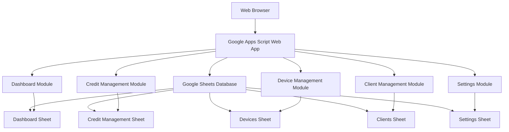
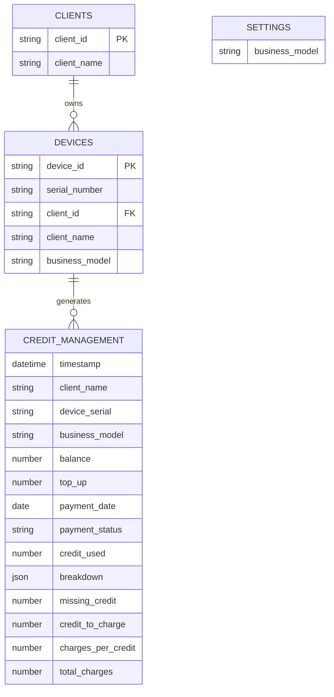
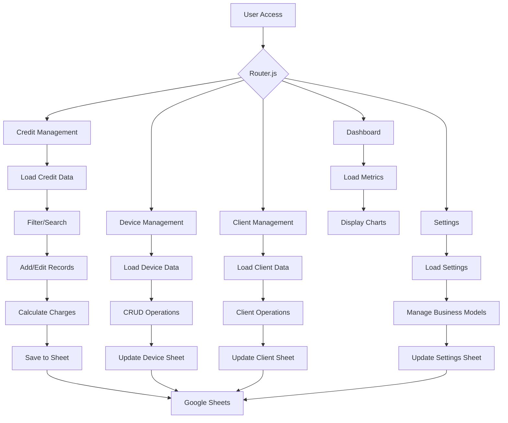

# Credit Management System for Medical Devices

A comprehensive web-based credit management system specifically designed for managing medical device credits, particularly for K-Laser systems. Built with Google Apps Script and deployed as a single web application.

## Features

### Dashboard
- **Visual Analytics**: Interactive charts showing payment status, business model breakdown, and credit utilization
- **Key Performance Indicators**: Average credit missing, balance from K-Laser system, and client report utilization

### Credit Management
- **Comprehensive Record Management**: Add, edit, and track credit transactions
- **Payment Tracking**: Monitor payment status (Paid, Pending, Unpaid)
- **Credit Breakdown**: Detailed usage breakdown with customizable categories
- **Financial Calculations**: Automatic calculation of charges and total amounts
- **Advanced Filtering**: Search and filter by client, device, business model, and payment status

### Device Management
- **Device Registry**: Complete device inventory with serial numbers
- **Client Association**: Link devices to specific clients
- **Business Model Assignment**: Categorize devices by business model
- **CRUD Operations**: Full create, read, update, delete functionality

### Client Management
- **Client Directory**: Comprehensive client database
- **Search Functionality**: Quick client lookup and filtering
- **Profile Management**: Add, edit, and remove client records

### Settings
- **Business Model Configuration**: Manage business model categories
- **System Preferences**: Configure system-wide settings

## Technology Stack



## Responsive Design

- **Mobile-First Approach**: Optimized for mobile devices
- **Adaptive Layout**: Responsive sidebar navigation
- **Touch-Friendly**: Mobile-optimized interactions
- **Cross-Platform**: Works on desktop, tablet, and mobile

## System Architecture


### Data Structure
The system uses Google Sheets as the database with the following sheets:

1. **Dashboard**: Aggregated metrics and chart data
2. **Credit Management**: Core transaction records
3. **Devices**: Device inventory and client associations
4. **Clients**: Client information database
5. **Settings**: System configuration and business models

### Database Schema


### File Structure
```
├── Router.js                 # Main routing logic
├── Dashboard-Tab.html        # Dashboard interface
├── Dashboard Tab.js          # Dashboard backend logic
├── Credit-Management-Tab.html # Credit management interface
├── Credit Management Tab.js   # Credit management backend
├── Device-Tab.html           # Device management interface
├── Device Tab.js             # Device management backend
├── Clients-Tab.html          # Client management interface
├── Clients Tab.js            # Client management backend
├── Settings-Tab.html         # Settings interface
├── Settings Tab.js           # Settings backend
├── 404.html                  # Error page
└── appsscript.json           # Project configuration
```

### System Workflow


## Installation & Setup

### Prerequisites
- Google account with access to Google Apps Script
- Google Sheets for data storage

### Deployment Steps

1. **Create Google Apps Script Project**
   - Go to [script.google.com](https://script.google.com)
   - Create a new project
   - Copy all files from this repository

2. **Set Up Google Sheets**
   Create a new Google Spreadsheet with the following sheets:
   - `Dashboard`
   - `Credit Management`
   - `Devices`
   - `Clients`
   - `Settings`

3. **Configure Sheet Headers**
   
   **Dashboard Sheet:**
   ```
   A1: Metric | B1: Value | C1: Chart Labels | D1: Chart Values | E1: Business Model Labels | F1: Business Model Values | G1: Credit Labels | H1: Credit Values
   ```

   **Credit Management Sheet:**
   ```
   A1: Timestamp | B1: ID | C1: Client Name | D1: Device ID | E1: Device Serial | F1: Business Model | G1: Balance | H1: Top Up | I1: Payment Date | J1: Payment Status | K1: Credit Used | L1: Breakdown | M1: Missing Credit | N1: Credit to Charge | O1: Charges per Credit | P1: Total Charges
   ```

   **Devices Sheet:**
   ```
   A1: Device ID | B1: Serial Number | C1: Client ID | D1: Client Name | E1: Business Model
   ```

   **Clients Sheet:**
   ```
   A1: Client ID | B1: Client Name
   ```

   **Settings Sheet:**
   ```
   A1: Business Model
   ```

4. **Deploy as Web App**
   - In Apps Script, go to Deploy > New Deployment
   - Choose "Web app" as type
   - Set execute as "Me" and access to "Anyone"
   - Deploy and copy the web app URL

## Usage

### Accessing the System
1. Navigate to the deployed web app URL
2. The system will automatically route to the Dashboard

### Navigation
- Use the sidebar to navigate between different modules
- The sidebar can be collapsed for more screen space
- Mobile users can access the menu via the hamburger button

### Key Workflows

#### Adding a New Device
1. Go to Devices tab
2. Click "Add Device"
3. Fill in serial number, select client and business model
4. Save the device

#### Recording Credit Transactions
1. Navigate to Credit Management
2. Click "Add New"
3. Select device, enter balance and credit details
4. Set payment status and date
5. Add usage breakdown
6. System calculates charges automatically

#### Managing Clients
1. Go to Clients tab
2. Add new clients or edit existing ones
3. Search and filter clients as needed

## Configuration

### Time Zone
The system is configured for Asia/Singapore timezone. To change:
1. Edit `appsscript.json`
2. Update the `timeZone` field

### Access Control
Current configuration allows anyone to access the web app. To restrict access:
1. In Apps Script deployment settings
2. Change access from "Anyone" to "Anyone with Google account" or "Only myself"

## Data Management

### Backup
- Regular Google Sheets backups are recommended
- Export data periodically for additional security

### Data Integrity
- The system includes validation for required fields
- Automatic calculations prevent manual errors
- Unique IDs ensure data consistency

## Customization

### Styling
- CSS variables in each HTML file control the color scheme
- Modify `:root` variables to change the theme
- Current theme uses teal and navy color palette

### Adding Features
- New functionality can be added by creating additional tabs
- Follow the existing pattern of HTML + JavaScript files
- Update the Router.js to include new routes

## Troubleshooting

### Common Issues

**"Sheet not found" Error:**
- Ensure all required sheets exist in the Google Spreadsheet
- Check sheet names match exactly (case-sensitive)

**Permission Denied:**
- Verify the Google Apps Script has access to the spreadsheet
- Check deployment permissions

**Data Not Loading:**
- Refresh the page
- Check browser console for JavaScript errors
- Verify internet connection
**Compatibility**: Google Apps Script V8 Runtime  
**Target**: Medical Device Credit Management
